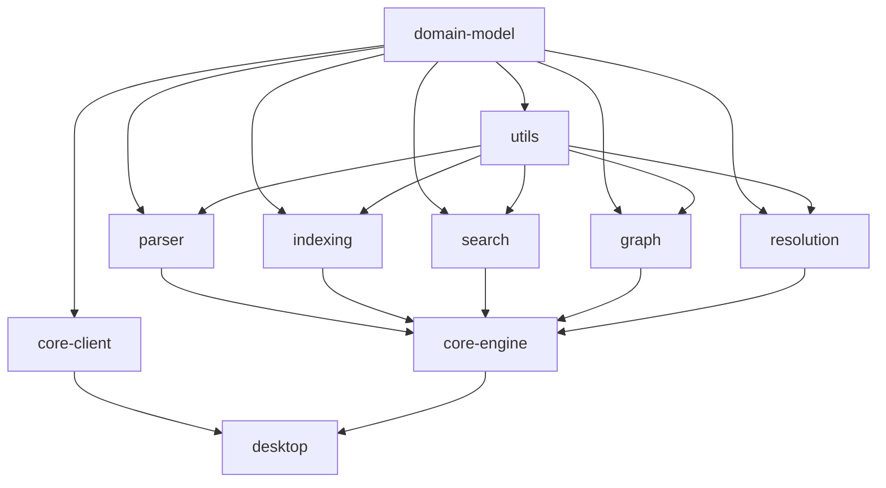

# Development Guide

Complete guide for developing Scribe, a personal note-taking system with markdown parsing, graph visualization, and intelligent search.

## Table of Contents

- [Architecture Overview](#architecture-overview)
- [Monorepo Structure](#monorepo-structure)
- [Package Responsibilities](#package-responsibilities)
- [Development Workflow](#development-workflow)
- [Build Process](#build-process)
- [Testing](#testing)
- [Code Style](#code-style)
- [Contribution Guidelines](#contribution-guidelines)

## Architecture Overview

Scribe is built as a Turborepo monorepo with three main layers:

1. **Core Engine** (`packages/core-engine`): Backend TypeScript service running as a child process
2. **Desktop App** (`apps/desktop`): Electron application with main process and React renderer
3. **Shared Packages** (`packages/*`): Reusable libraries for parsing, indexing, search, etc.

### Communication Architecture

```
┌─────────────────────────────────────────────────┐
│             Electron Main Process               │
│  ┌──────────────┐          ┌────────────────┐  │
│  │   IPC Bridge │◄────────►│ Core Engine    │  │
│  │              │          │ (Child Process)│  │
│  └──────┬───────┘          └────────────────┘  │
│         │                                        │
└─────────┼────────────────────────────────────────┘
          │
┌─────────▼────────────────────────────────────────┐
│           React Renderer (Vite)                  │
│  ┌──────────────┐          ┌────────────────┐   │
│  │   UI Layer   │◄────────►│  core-client   │   │
│  │ (Components) │          │  (API Wrapper) │   │
│  └──────────────┘          └────────────────┘   │
└──────────────────────────────────────────────────┘
```

- **Electron Main Process**: Spawns and manages Core Engine child process
- **Core Engine**: JSON-RPC server handling all backend operations
- **IPC Bridge**: Routes messages between renderer and Core Engine
- **core-client**: Typed API wrapper hiding IPC/RPC complexity from UI

## Monorepo Structure

### Apps

#### `apps/desktop`

Electron desktop application with three main parts:

- **main/**: Electron main process
  - `index.ts`: Entry point, app lifecycle
  - `core-engine-manager.ts`: Spawns and manages Core Engine
  - `ipc.ts`: IPC handlers for renderer ↔ Core Engine communication

- **preload/**: Preload scripts for secure IPC
  - `index.ts`: Exposes `window.scribeAPI` to renderer
  - `index.js`: Compiled CommonJS bundle (generated via esbuild)
  - **Note**: Preload scripts must use CommonJS format for Electron compatibility

- **renderer/**: React UI built with Vite
  - `src/App.tsx`: Main application component
  - `src/main.tsx`: React entry point

### Packages

#### Core Engine

**`packages/core-engine`**
Main backend service running as a child process. Coordinates all subsystems.

- JSON-RPC server listening on stdin/stdout
- Manages app state and orchestrates services
- Handles all backend operations (indexing, search, graph queries)

**Key files**:

- `src/engine.ts`: Main CoreEngine class
- `src/rpc/server.ts`: JSON-RPC server implementation
- `src/rpc/handlers.ts`: RPC method handlers
- `src/index.ts`: Entry point for child process

#### Client Libraries

**`packages/core-client`**
Typed TypeScript API wrapper for communicating with Core Engine.

- Hides JSON-RPC complexity from UI
- Provides typed methods like `search()`, `getNote()`, `listNotes()`
- Handles request/response serialization

**`packages/domain-model`**
Shared TypeScript types and data structures used across all packages.

- Entity types: `NoteId`, `PersonId`, `TagId`, etc.
- Data structures: `ParsedNote`, `AppState`, `SearchResult`
- Graph types: `GraphNode`, `GraphEdge`

#### Core Subsystems

**`packages/parser`**
Markdown parsing pipeline converting raw files to `ParsedNote` objects.

- Extracts frontmatter, titles, headings
- Finds links (`[[Note]]`), embeds (`![[Note]]`), tags (`#tag`)
- Detects people mentions (`@Person`)
- Uses `remark` for AST parsing

**`packages/indexing`**
Entity indexing system maintaining registries and indices.

- Note registry (by ID, path, title, alias)
- People index (mentions, relationships)
- Tag index (notes by tag, tags by note)
- Folder index (hierarchy, children)
- Heading index (by ID, by note)
- Embed index (source/target relationships)

**`packages/search`**
Search engine with fuzzy and full-text search capabilities.

- Uses `fuse.js` for fuzzy search
- Full-text search across note content
- Ranking and relevance scoring
- Configurable search options

**`packages/graph`**
Graph construction and query system.

- Builds directed graph from notes and relationships
- Adjacency maps for outgoing/incoming edges
- Graph traversal and neighbor queries
- Edge types: note-links-note, note-embeds-note, etc.

**`packages/resolution`**
Link and entity resolution engine.

- Resolves `[[Note]]` references to actual notes
- Handles ambiguous references
- Resolves `@Person` mentions to person entities
- Tracks unlinked mentions for discovery

**`packages/file-watcher`**
File system watching with debouncing.

- Watches vault directory for changes
- Debounces rapid file events
- Emits change events (add, modify, delete)

**`packages/utils`**
Shared utility functions.

- Text normalization (`normalizeText`, `normalizeHeading`)
- ID generation (`generateNoteId`, `generatePersonId`)
- Debounce helper
- Path utilities

#### Configuration

**`config/tsconfig`**
Shared TypeScript configurations.

- `base.json`: Base config for all packages
- `node.json`: Node.js backend packages
- `react.json`: React UI packages
- `electron.json`: Electron apps

**`config/eslint`**
Shared ESLint configurations.

- `index.js`: Base config
- `react.js`: React-specific rules

**`config/prettier`**
Shared Prettier configuration for consistent formatting.

## Package Responsibilities

| Package        | Purpose          | Dependencies            |
| -------------- | ---------------- | ----------------------- |
| `domain-model` | Shared types     | None (foundation)       |
| `utils`        | Utilities        | None                    |
| `parser`       | Markdown parsing | `domain-model`, `utils` |
| `indexing`     | Entity indexing  | `domain-model`, `utils` |
| `search`       | Search engine    | `domain-model`, `utils` |
| `graph`        | Graph system     | `domain-model`, `utils` |
| `resolution`   | Link resolution  | `domain-model`, `utils` |
| `file-watcher` | FS watching      | `utils`                 |
| `core-engine`  | Backend service  | All subsystems          |
| `core-client`  | API wrapper      | `domain-model`          |
| `desktop`      | Electron app     | `core-client`           |

## Development Workflow

### Initial Setup

```bash
# Clone the repository
git clone <repo-url>
cd scribe

# Install dependencies
bun install

# Verify installation
bun run build
bun run test
```

### Development Mode

Start all development servers concurrently:

```bash
bun run dev
```

This runs `dev.sh` which starts:

1. **Core Engine** in watch mode (`bun --watch`)
2. **Electron main process** with hot reload
3. **Vite dev server** for React renderer with HMR

The app will automatically reload when you make changes to any package.

### Working on Individual Packages

```bash
# Navigate to package
cd packages/parser

# Run tests in watch mode
bun test --watch

# Type-check
bun run build

# Run specific tests
bun test src/index.test.ts
```

### Adding a New Package

1. Create package directory:

```bash
mkdir -p packages/my-package/src
cd packages/my-package
```

2. Create `package.json`:

```json
{
  "name": "@scribe/my-package",
  "version": "0.1.0",
  "private": true,
  "type": "module",
  "main": "./src/index.ts",
  "types": "./src/index.ts",
  "scripts": {
    "build": "tsc --noEmit",
    "test": "bun test",
    "lint": "eslint src"
  },
  "dependencies": {
    "@scribe/domain-model": "workspace:*"
  },
  "devDependencies": {
    "@scribe/eslint-config": "workspace:*",
    "@scribe/tsconfig": "workspace:*",
    "@types/bun": "^1.3.2",
    "typescript": "^5.7.2"
  }
}
```

3. Create `tsconfig.json`:

```json
{
  "extends": "@scribe/tsconfig/node.json",
  "compilerOptions": {
    "outDir": "dist",
    "rootDir": "src"
  },
  "include": ["src/**/*"],
  "exclude": ["node_modules", "dist", "**/*.test.ts"]
}
```

4. Add to workspace and install dependencies:

```bash
bun install
```

## Build Process

### Full Build

```bash
# Build all packages in dependency order
bun run build
```

Turborepo automatically handles:

- Dependency ordering (packages built in correct sequence)
- Parallel execution (independent packages built concurrently)
- Caching (unchanged packages skipped)

### Build Pipeline



### Package Desktop App

```bash
# Build and package for distribution
bun run package
```

This:

1. Runs full build (`bun run build`)
2. Bundles Electron app with `electron-builder`
3. Creates distributable in `apps/desktop/dist/`

### Development Scripts

All scripts defined in root `package.json`:

```json
{
  "scripts": {
    "dev": "./dev.sh", // Start dev servers
    "build": "turbo run build", // Build all packages
    "test": "turbo run test", // Run all tests
    "lint": "turbo run lint", // Lint all packages
    "package": "bun run build && ...", // Package app
    "clean": "turbo run clean && ..." // Clean build artifacts
  }
}
```

## Testing

### Test Infrastructure

- **Test Runner**: Bun's built-in test runner
- **Test Framework**: Bun test API (`describe`, `test`, `expect`)
- **UI Testing**: React Testing Library (basic setup)
- **Coverage**: 72 tests across 7 packages

### Running Tests

```bash
# Run all tests
bun run test

# Run tests for specific package
cd packages/utils
bun test

# Run tests in watch mode
bun test --watch

# Run specific test file
bun test src/normalize.test.ts
```

### Test Organization

Each package has tests co-located with source code:

```
packages/utils/
├── src/
│   ├── normalize.ts
│   ├── normalize.test.ts      # Unit tests
│   ├── id-generation.ts
│   └── id-generation.test.ts
└── package.json
```

### Writing Tests

Example unit test:

```typescript
import { describe, test, expect } from 'bun:test';
import { normalizeText } from './normalize';

describe('normalizeText', () => {
  test('should convert to lowercase', () => {
    expect(normalizeText('Hello World')).toBe('hello world');
  });

  test('should trim whitespace', () => {
    expect(normalizeText('  hello  ')).toBe('hello');
  });
});
```

### Test Coverage by Package

| Package            | Tests  | Coverage                               |
| ------------------ | ------ | -------------------------------------- |
| `utils`            | 38     | Normalization, ID generation, debounce |
| `parser`           | 4      | Note parsing, file handling            |
| `indexing`         | 6      | App state, indexing operations         |
| `search`           | 13     | Search engine functionality            |
| `core-client`      | 6      | IPC/RPC communication                  |
| `core-engine`      | 3      | Engine lifecycle                       |
| `desktop-renderer` | 2      | React components                       |
| **Total**          | **72** |                                        |

## Code Style

### TypeScript

- **Strict mode**: Enabled in all packages
- **Module system**: ESM (`"type": "module"`)
- **Target**: ES2022
- **Imports**: Use `.js` extension for local imports (ESM requirement)

Example:

```typescript
import type { ParsedNote } from '@scribe/domain-model';
import { normalizeText } from './normalize.js'; // Note .js extension
```

### Formatting

- **Tool**: Prettier
- **Config**: `config/prettier/index.json`
- **Line length**: 100 characters
- **Trailing commas**: ES5
- **Single quotes**: Yes

### Linting

- **Tool**: ESLint
- **Config**: `config/eslint/`
- **Rules**: TypeScript recommended + React hooks

Run linting:

```bash
bun run lint
```

### File Naming

- **Source files**: `kebab-case.ts`
- **Test files**: `kebab-case.test.ts`
- **Components**: `PascalCase.tsx`
- **Types**: `PascalCase` or `camelCase` depending on usage

### Import Organization

```typescript
// 1. External dependencies
import { useState } from 'react';
import type { Map } from 'immutable';

// 2. Internal packages (scoped)
import type { ParsedNote } from '@scribe/domain-model';
import { normalizeText } from '@scribe/utils';

// 3. Local imports
import { parseNote } from './parser.js';
import type { ParserOptions } from './types.js';
```

## Contribution Guidelines

### Branch Strategy

- `main`: Production-ready code
- `develop`: Integration branch for features
- `feature/*`: New features
- `fix/*`: Bug fixes

### Commit Messages

Follow conventional commits:

```
<type>(<scope>): <subject>

<body>

<footer>
```

Types:

- `feat`: New feature
- `fix`: Bug fix
- `docs`: Documentation changes
- `test`: Adding or updating tests
- `refactor`: Code refactoring
- `chore`: Build/tooling changes

Examples:

```
feat(parser): add support for frontmatter tags

Implement tag extraction from YAML frontmatter in addition
to inline tags in note content.

Closes #123
```

```
fix(search): correct fuzzy search scoring

The fuzzy search was incorrectly weighting partial matches.
Adjusted the scoring algorithm to prioritize exact matches.
```

### Pull Request Process

1. **Create feature branch**:

   ```bash
   git checkout -b feature/my-feature
   ```

2. **Make changes and commit**:

   ```bash
   git add .
   git commit -m "feat(scope): description"
   ```

3. **Ensure tests pass**:

   ```bash
   bun run test
   bun run build
   bun run lint
   ```

4. **Push and create PR**:

   ```bash
   git push origin feature/my-feature
   ```

5. **PR checklist**:
   - [ ] Tests pass
   - [ ] Build succeeds
   - [ ] Linting passes
   - [ ] Documentation updated
   - [ ] Commit messages follow convention

### Code Review Guidelines

- Keep PRs focused and small
- Include tests for new features
- Update documentation for API changes
- Respond to feedback constructively
- Squash commits before merging

### Development Best Practices

1. **Type Safety**: Use strict TypeScript types, avoid `any`
2. **Testing**: Write tests for new features and bug fixes
3. **Documentation**: Update docs when changing APIs
4. **Performance**: Consider performance implications
5. **Dependencies**: Minimize external dependencies
6. **Accessibility**: Follow WCAG guidelines for UI

### Getting Help

- **Architecture docs**: See `architecture/` directory
- **Issues**: File bugs and feature requests on GitHub
- **Discussions**: Use GitHub Discussions for questions

---

## Useful Commands Reference

```bash
# Development
bun run dev              # Start all dev servers
bun run build            # Build all packages
bun run test             # Run all tests
bun run lint             # Lint all code

# Package specific
cd packages/<name>
bun test                 # Run package tests
bun run build            # Type-check package
bun test --watch         # Watch mode

# Packaging
bun run package          # Build desktop app

# Cleanup
bun run clean            # Remove build artifacts
rm -rf node_modules      # Clean dependencies
bun install              # Reinstall
```

## Troubleshooting

### Build Errors

**Problem**: TypeScript errors in tests

```
error TS2307: Cannot find module 'bun:test'
```

**Solution**: Ensure `@types/bun` is installed and test files are excluded from build:

```json
{
  "exclude": ["**/*.test.ts", "**/*.test.tsx"]
}
```

### Test Failures

**Problem**: Tests fail with module resolution errors

**Solution**: Check that imports use `.js` extension for local files:

```typescript
import { foo } from './bar.js'; // Correct
import { foo } from './bar'; // Incorrect in ESM
```

### Development Mode Issues

**Problem**: Electron app doesn't start

**Solution**: Ensure Core Engine is built first:

```bash
cd packages/core-engine
bun run build
cd ../..
bun run dev
```

### Dependency Issues

**Problem**: Module not found errors

**Solution**: Clean and reinstall:

```bash
bun run clean
rm -rf node_modules
bun install
```

### Preload Script Issues

**Problem**: `Unable to load preload script` or `Cannot use import statement outside a module`

```
VM4 sandbox_bundle:2 Unable to load preload script: .../preload/index.js
VM4 sandbox_bundle:2 SyntaxError: Cannot use import statement outside a module
```

**Solution**: Preload scripts must be compiled to CommonJS format. Run:

```bash
cd apps/desktop
bun run preload:build
```

The `preload:build` script uses esbuild to bundle the preload script in CommonJS format, which is required for Electron's preload environment. This script is automatically run as part of `bun run dev` and `bun run build`.
