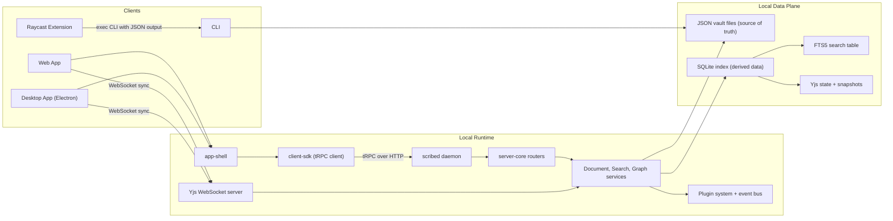
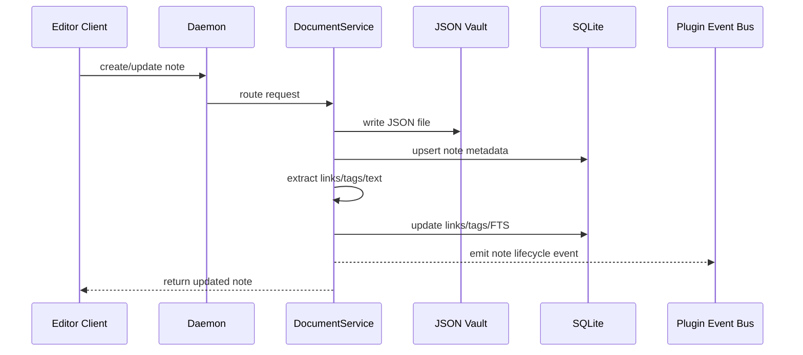
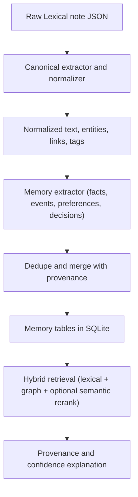
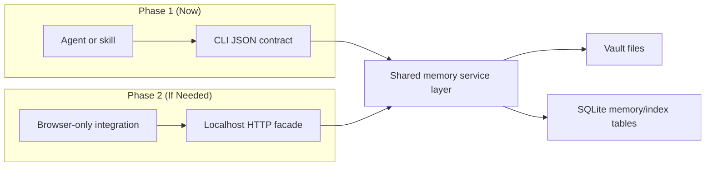

# Agent Memory System: Repo Analysis and Design Plan

Date: 2026-02-06

## Context

Goal: evolve Scribe from a note-taking app into a local-first memory system that:

- accepts notes from multiple clients,
- acts as a "second brain",
- exposes that memory to other agents/systems,
- works on a local machine,
- supports environments where MCP is unavailable.

Additional constraint: editor framework is Lexical with an opinionated JSON format.

## Executive Summary

Scribe is already close to the target architecture. It has:

- local-first source-of-truth files in a vault,
- a local daemon,
- SQLite derived indexes,
- JSON-capable CLI integration points.

The main missing piece is not infrastructure, but a canonical memory layer and stable external contract for agents.

Recommended sequence:

1. CLI-first memory contract now.
2. Canonical memory schema + ingestion pipeline.
3. Optional localhost HTTP facade only when direct editor/external integrations cannot shell out to CLI.

## What Already Fits the Vision

### 1) Local-first architecture is already foundational

- Daemon-centric architecture with local clients: `README.md:7`, `README.md:25`, `README.md:27`
- JSON files as source-of-truth and SQLite as derived data:
  - `docs/architecture.md:11`
  - `docs/architecture.md:239`
  - `packages/server-core/src/services/document.service.ts:5`
  - `packages/server-core/src/services/document.service.ts:6`
- Local filesystem vault implementation:
  - `packages/storage-fs/src/storage.ts:65`
  - `packages/storage-fs/src/storage.ts:123`

### 2) API/runtime pieces already exist

- Local daemon with HTTP+tRPC and WebSocket:
  - `docs/architecture.md:23`
  - `docs/architecture.md:24`
  - `packages/scribed/src/daemon.ts:191`
  - `packages/scribed/src/daemon.ts:198`
- Plugin event hooks on note lifecycle:
  - `packages/server-core/src/services/document.service.ts:185`
  - `packages/server-core/src/services/document.service.ts:302`
  - `packages/server-core/src/services/document.service.ts:356`
  - `packages/scribed/src/daemon.ts:140`
  - `packages/scribed/src/daemon.ts:151`

### 3) CLI already supports machine consumption

- Default output format is JSON:
  - `apps/cli/src/cli.ts:36`
  - `apps/cli/src/cli.ts:90`
  - `apps/cli/src/output.ts:23`
- CLI runs directly on local vault + engines (works even without daemon path for many commands):
  - `apps/cli/src/context.ts:16`
  - `apps/cli/src/context.ts:17`
  - `apps/cli/src/context.ts:18`
  - `apps/cli/src/context.ts:19`
  - `apps/cli/src/context.ts:194`
- Non-MCP client pattern already proven (Raycast shells out to CLI JSON):
  - `apps/desktop/resources/raycast-extension/src/lib/cli.ts:56`
  - `apps/desktop/resources/raycast-extension/src/lib/cli.ts:57`
  - `apps/desktop/resources/raycast-extension/src/lib/cli.ts:78`

## Consequences of Lexical as Canonical Editor

Lexical is a good editing/runtime format, but should not be the external memory contract.

### Benefits

- Rich structural semantics and extensibility in editor.
- Precise block/entity extraction opportunities.
- Fits current editor stack:
  - `packages/editor/src/components/ScribeEditor.tsx:2`
  - `packages/editor/src/components/ScribeEditor.tsx:39`
  - `packages/editor/src/components/ScribeEditor.tsx:186`

### Costs/Risks

- Tight coupling risk if downstream consumers require Lexical internals.
- Node shape/version drift can break extraction logic.
- Harder interoperability for non-Lexical clients and external agents.

### Concrete drift already visible

Link extraction differs across stacks:

- Server-core extractor expects `wikilink` + `noteId`:
  - `packages/server-core/src/services/document.service.ts:480`
  - `packages/server-core/src/services/document.service.ts:482`
- Engine-core extractor expects `wiki-link` + `targetId`:
  - `packages/engine-core/src/metadata.ts:96`
  - `packages/engine-core/src/metadata.ts:97`

Implication: memory extraction needs one canonical parser contract used by both daemon and CLI paths.

## Current Gaps for "Agent Memory System"

### 1) No explicit memory model yet

Current schema centers on note metadata, links, tags, FTS, collaboration, snapshots:

- `packages/server-db/src/schema.ts:29`
- `packages/server-db/src/schema.ts:55`
- `packages/server-db/src/schema.ts:86`
- `packages/server-db/src/schema.ts:104`
- `packages/server-db/src/schema.ts:117`
- `packages/server-db/src/schema.ts:128`

Missing explicit primitives like:

- `memory_items` (fact/event/preference/decision),
- provenance fields (`source_note_id`, offsets, extraction version),
- confidence and validity intervals,
- dedupe/merge tracking.

### 2) Retrieval is lexical-first, not semantic memory retrieval

Search is currently SQLite FTS5/BM25 centered:

- `docs/architecture.md:19`
- `packages/server-db/src/repositories/search.repository.ts:37`
- `packages/server-db/src/repositories/search.repository.ts:64`

This is useful, but not sufficient for robust memory recall tasks (semantic similarity, conflict resolution, provenance explanation).

### 3) Type contract drift across layers

`NoteType` differs between server-db and shared types:

- Server DB:
  - `packages/server-db/src/types.ts:9`
  - `packages/server-db/src/schema.ts:33`
- Shared:
  - `packages/shared/src/types/note-types.ts:98`
- Router filters constrained to server-db enum:
  - `packages/server-core/src/routers/notes.router.ts:17`
  - `packages/server-core/src/routers/search.router.ts:16`

This should be reconciled before exposing stronger external contracts.

## CLI vs HTTP: What You Need Now

Short answer: you do not need HTTP immediately if CLI integration is acceptable for your consuming systems.

Use CLI now when:

- the caller can spawn local processes,
- request volume is moderate,
- simple request/response is enough,
- you want fastest path to usable agent memory integration.

Add localhost HTTP when:

- browser-only clients cannot shell out,
- you need long-lived sessions/streaming,
- you need language-agnostic network clients,
- deployment requires a stable local service boundary.

In this repo, editor/web/desktop already talk to daemon over tRPC+WS. For non-MCP workplace agents, CLI JSON contract is the lowest-friction bridge.

## Non-MCP Integration Options (Practical Ranking)

1. CLI JSON contract (recommended first)
- Pattern: `scribe <command> --format json`
- Easy to wrap in skills/tools and scripting.
- Already present and proven.

2. Localhost HTTP facade (second)
- Add a thin REST or JSON-RPC facade over existing services.
- Useful for clients that cannot execute binaries.

3. Filesystem handoff contract (niche fallback)
- Request/response JSON files in watched directory.
- Works in locked-down environments but higher operational complexity.

## Target Architecture for Agent Memory (Repo-Aligned)

Keep this separation strict:

- Source layer: raw notes (`Lexical JSON`) in vault files.
- Canonical layer: normalized extracted memory objects.
- Retrieval layer: lexical + graph + optional semantic ranking.
- Interface layer: CLI contract first, optional HTTP facade.

### Proposed Memory Object (v1)

Each extracted memory item should include:

- `id`
- `kind` (`fact|event|preference|decision|todo|entity`)
- `subject`
- `predicate` / `summary`
- `object` / `value`
- `source_note_id`
- `source_offsets` (or block/node path)
- `observed_at`, `created_at`, `updated_at`
- `confidence`
- `status` (`active|superseded|invalidated`)
- `extraction_version`

### Ingestion flow

1. Note mutation event emitted from `DocumentService` lifecycle hooks.
2. Canonical extractor parses Lexical to normalized spans/entities/links.
3. Memory extractor emits candidate memory items.
4. Deduper/updater merges against existing memory store.
5. Indexers update retrieval views (FTS + graph + optional vectors).

### Retrieval flow

For each query:

1. Lexical/FTS candidate retrieval.
2. Graph expansion from links/entities.
3. Optional semantic rerank.
4. Return answer with provenance and confidence.

## Package-Level Implementation Plan

### Phase 0: Contract hardening (first)

- Unify metadata extraction implementation across `server-core` and `engine-core`.
- Reconcile note type enum source of truth and router schemas.
- Add extraction snapshot tests for representative Lexical payloads.

### Phase 1: Memory schema + ingestion

- Add memory tables/repositories in `@scribe/server-db`.
- Add memory ingestion service in `@scribe/server-core`.
- Wire ingestion to existing note lifecycle events.

### Phase 2: CLI memory interface (primary external contract)

Add new CLI namespace (JSON-first):

- `scribe memory ingest --note <id>`
- `scribe memory query --q "<prompt>" --limit 20`
- `scribe memory get --id <memory-id>`
- `scribe memory explain --id <memory-id>`
- `scribe memory reconcile --note <id>|--all`

Outputs should always include provenance and schema version.

### Phase 3: Skills/workplace integration (no MCP requirement)

- Provide skill wrappers that invoke CLI and parse JSON.
- Keep commands deterministic and non-interactive.
- Publish contract examples and error code semantics.

### Phase 4: Optional HTTP facade

- Expose stable local endpoints only if/when direct non-CLI integration is required.
- Keep HTTP as thin transport over same core memory service.

## Testing and Validation Strategy

Minimum coverage needed for confidence:

- Lexical fixture tests for extraction parity across code paths.
- Snapshot tests for memory object generation and dedupe behavior.
- CLI contract tests for JSON schema stability.
- End-to-end: note create/update/delete -> memory ingest/update/invalidate.

## Open Decisions

- Memory invalidation semantics on note edits/deletions.
- Confidence scoring and conflict resolution policy.
- Whether to introduce vectors in v1 or stay lexical+graph first.
- Whether memory schema lives in core DB or plugin namespace first.

## Recommended Immediate Next Step

Implement Phase 0 before introducing any new memory API surface:

1. Unify Lexical extraction contracts.
2. Unify note type enum source-of-truth.
3. Add fixture tests to lock behavior.

This removes current drift and gives a stable base for the memory layer.

## Architecture Diagrams

### 1) Current System (As-Is)

### 2) Note Write Flow (Today)

### 3) Target Memory Pipeline (To-Be)

### 4) Integration Strategy Without MCP

